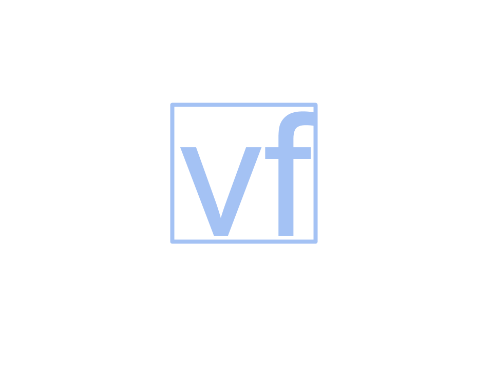

# Videoflow



[](https://travis-ci.org/videoflow/videoflow)
[](https://github.com/videoflow/videoflow/blob/master/LICENSE)

**Videoflow** is a Python framework for video stream processing. The library is designed to facilitate easy and quick definition of computer vision stream processing applications. It empowers developers to build applications and systems with self-contained Deep Learning and Computer Vision capabilities using simple and few lines of code.  It contains off-the-shelf components for object detection, object tracking, human pose estimation, etc, and it is easily extensible.

Below there is a quick first sample application.  You can see more examples in the [**examples**](https://github.com/videoflow/videoflow/tree/master/examples) folder.  

The complete documentation to the project is located in [**Read the docs.**](https://videoflow.readthedocs.io)

## Installing the framework
Before installing, be sure that you have `cv2` and `tensorflow` already 
installed.

You can install directly using **pip** by doing `pip3 install videoflow`

Alternatively, you can install by:

1. Clone this repository
2. Inside the repository folder, execute `pip3 install . --user`

Python 2 is **NOT SUPPORTED**.  Requies Python 3.5+

## Simple sample videoflow application:

```
from videoflow.core import Flow
from videoflow.producers import IntProducer
from videoflow.processors.aggregators import SumAggregator
from videoflow.consumers import CommandlineConsumer

producer = IntProducer(0, 40, 0.01)
sum_agg = SumAggregator()(producer)
printer = CommandlineConsumer()(sum_agg)

flow = Flow([producer], [printer])
flow.run()
flow.join()
```

Lines 1-4 import the classes and definitions needed.

Lines 6-8 define a simple linear graph of nodes where a stream of integers from 0 to 40 are added and the running addition gets printed in the command line.  You can define any kind of directed graph for as long as it has no cycles.

Lines 10-12 create the flow, start it, and wait for it to finish.

## The Structure of a flow application

A flow application usually consists of three parts:

1. In the first part of the application you define a directed acyclic graph of computation nodes. There are 3 different kinds of nodes: producers, processors and consumers.  Producer nodes create data (commonly they will get the data from a source that is external to the flow).  Processors receive data as input and produce data as output. Consumers read data and do not produce any output.  You usually use a consumer when you want to write results to a log file, or when you want to push results to an external source (rest API, S3 bucket, etc.)

2. To create a flow object, you need to pass to it your list of producers and your list of consumers. Once a flow is defined you can start it.  Starting the flow means that the producers start putting data into the flow and processors and consumers start receiving data.  Starting the flow also means allocating resources for producers, processors and consumers.  For simplicity for now we can say that each producer, processor and consumer will run on its own process space.

3. Once the flow starts, you can also stop it.  When you stop the flow, it will happen organically.  Producers will stop producing data.  The rest of the nodes in the flow will continue running until the pipes run dry.  The resources used in the flow are deallocated progressively, as each node stops producing/processing/consuming data.
