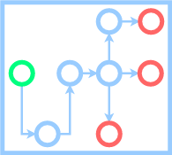

# Videoflow



[](https://travis-ci.org/videoflow/videoflow)
[](https://github.com/videoflow/videoflow/blob/master/LICENSE)

**Videoflow** is a Python framework for video stream processing. The library is designed to facilitate easy and quick definition of computer vision stream processing pipelines. It empowers developers to build applications and systems with self-contained Deep Learning and Computer Vision capabilities using simple and few lines of code.  It contains off-the-shelf reference components for object detection, object tracking, human pose estimation, etc, and it is easy to extend with your own.

The complete documentation to the project is located in [**docs.videoflow.dev**](https://docs.videoflow.dev)

[1.2]: http://i.imgur.com/wWzX9uB.png
[1]: http://www.twitter.com/videoflow_py
<!--Follow us on [![alt text][1.2]][1]-->

## Installing the framework
### Requirements
Before installing, be sure that you have `cv2` already installed. Python 2 is **NOT SUPPORTED**.  Requires Python 3.6+.  There are some [known issues](https://github.com/videoflow/videoflow/issues/56) to run it on Windows too

### Installation
You can install directly using **pip** by doing `pip3 install videoflow`

Alternatively, you can install by:

1. Clone this repository
2. Inside the repository folder, execute `pip3 install . --user`

**Usage with docker**
```bash
# clone repo
docker build -t repo/videoflow:latest .
# runs examples/object_detector.py by default
docker run -u $(id -u):$(id -g) -v $(pwd):/usr/src/app repo/videoflow
# or mount the volume from your code directory  to /usr/src/app
docker run -u $(id -u):$(id -g) -v $(pwd):/usr/src/app repo/videoflow python /usr/src/app/yourown.py
```
## Contributing:
A tentative [roadmap](ROADMAP.md) of where we are headed.

[Contribution rules](CONTRIBUTING.md).

If you have new processors, producers or consumers that you can to create, check the [videoflow-contrib](https://github.com/videoflow/videoflow-contrib) project.  We want 
to keep videoflow succinct, clean, and simple, with as minimal dependencies to third-party libraries as necessaries. [videoflow-contrib](https://github.com/videoflow/videoflow-contrib) is better suited for adding new components that require new library 
dependencies.

## Sample Videoflow application:
Below a sample videoflow application that detects automobiles in an intersection. For more examples see the [examples](examples/) folder. It uses detection model published by [tensorflow/models](https://github.com/tensorflow/models/tree/master/research/object_detection)

[](https://www.youtube.com/watch?v=TYGMllb7fHM)

```python
import videoflow
import videoflow.core.flow as flow
from videoflow.core.constants import BATCH
from videoflow.consumers import VideofileWriter
from videoflow.producers import VideofileReader
from videoflow_contrib.detector_tf import TensorflowObjectDetector
from videoflow.processors.vision.annotators import BoundingBoxAnnotator
from videoflow.utils.downloader import get_file

URL_VIDEO = "https://github.com/videoflow/videoflow/releases/download/examples/intersection.mp4"

class FrameIndexSplitter(videoflow.core.node.ProcessorNode):
    def __init__(self):
        super(FrameIndexSplitter, self).__init__()
    
    def process(self, data):
        index, frame = data
        return frame

input_file = get_file("intersection.mp4", URL_VIDEO)
output_file = "output.avi"
reader = VideofileReader(input_file)
frame = FrameIndexSplitter()(reader)
detector = TensorflowObjectDetector()(frame)
annotator = BoundingBoxAnnotator()(frame, detector)
writer = VideofileWriter(output_file, fps = 30)(annotator)
fl = flow.Flow([reader], [writer], flow_type = BATCH)
fl.run()
fl.join()
```

The output of the application is an annotated video:


## The Structure of a flow application

A flow application usually consists of three parts:

1. In the first part of the application you define a directed acyclic graph of computation nodes. There are 3 different kinds of nodes: producers, processors and consumers.  Producer nodes create data (commonly they will get the data from a source that is external to the flow).  Processors receive data as input and produce data as output. Consumers read data and do not produce any output.  You usually use a consumer when you want to write results to a log file, or when you want to push results to an external source (rest API, S3 bucket, etc.)

2. To create a flow object, you need to pass to it your list of producers and your list of consumers. Once a flow is defined you can start it.  Starting the flow means that the producers start putting data into the flow and processors and consumers start receiving data.  Starting the flow also means allocating resources for producers, processors and consumers.  For simplicity for now we can say that each producer, processor and consumer will run on its own process space.

3. Once the flow starts, you can also stop it.  When you stop the flow, it will happen organically.  Producers will stop producing data.  The rest of the nodes in the flow will continue running until the pipes run dry.  The resources used in the flow are deallocated progressively, as each node stops producing/processing/consuming data.

## Citing Videoflow
If you use Videoflow in your research please use the following BibTeX entry.

```
@misc{deArmas2019videoflow,
  author =       {Jadiel de Armas},
  title =        {Videoflow},
  howpublished = {\url{https://github.com/videoflow/videoflow}},
  year =         {2019}
}
```
