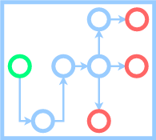

# Videoflow



[](https://github.com/videoflow/videoflow/blob/master/LICENSE)

**Videoflow** is a Python framework for building **distributed** video and stream
processing pipelines. You describe your pipeline once as a directed acyclic graph
of producers, processors and consumers, and Videoflow runs it as a set of
independent workers that communicate over a [NATS JetStream](https://docs.nats.io/nats-concepts/jetstream)
message broker.

The same graph runs two ways with no code changes:

- **Locally**, as one OS subprocess per node — for fast development and testing.
- **On Kubernetes**, as one container per node — with per-node scaling, GPU
  scheduling, health probes and autoscaling for production.

It ships with off-the-shelf components for object detection, tracking, pose
estimation, segmentation and video I/O, is easy to extend with your own, and can
run [components written in any language](#language-agnostic-components) shipped as
container images.

---

## How it works

```
   ┌──────────┐      ┌───────────┐      ┌───────────┐      ┌──────────┐
   │ producer │─────▶│ processor │─────▶│ processor │─────▶│ consumer │
   └──────────┘      └───────────┘      └───────────┘      └──────────┘
        │                  │                  │                  │
        └──────────────────┴───── NATS JetStream ───────────────┘
                        (one stream per node)
```

- Each **node** is identified by a stable, unique `name` and runs in its own
  worker (subprocess locally, pod on Kubernetes).
- Every node publishes its output to its own broker subject; each node subscribes
  to the subjects of its real parents and reassembles its inputs. This makes
  arbitrary DAGs — multi-parent joins, multiple independent producers, fan-out —
  work naturally.
- A node's constructor arguments must be **JSON-serializable** so a worker can
  reconstruct just its one node from configuration. Expensive or stateful setup
  (opening a camera, loading a model) belongs in the node's `open()` method, not
  its `__init__`.

---

## Installation

Requires **Python 3.12+** and a running NATS JetStream server at runtime.

```bash
pip install "videoflow[distributed]"   # core + broker client + wire format
pip install "videoflow[vision]"        # + OpenCV for vision processors
pip install "videoflow[video]"         # + ffmpeg/OpenCV for video I/O
pip install "videoflow[deploy]"        # + Kubernetes manifest generation
pip install "videoflow[all]"           # everything
```

From a clone with [uv](https://docs.astral.sh/uv/): `uv sync` (creates `.venv`
with all dependencies). Or with pip: `pip install ".[all]"`.

Start a local broker for development (a `docker-compose.yml` with NATS + Redis is
included):

```bash
docker compose up -d          # NATS JetStream on :4222, Redis on :6379
# or, without Docker:
nats-server -js
```

---

## Quickstart

A pipeline is defined inside a `build_flow()` factory that returns a `Flow`. The
same factory is used to run locally and to deploy to Kubernetes.

```python
from videoflow.core import Flow
from videoflow.core.constants import BATCH
from videoflow.producers import IntProducer
from videoflow.processors import IdentityProcessor, JoinerProcessor
from videoflow.consumers import CommandlineConsumer

def build_flow():
    producer  = IntProducer(0, 40, 0.1, name='producer')
    identity  = IdentityProcessor(name='identity')(producer)
    identity1 = IdentityProcessor(name='identity1')(identity)
    joined    = JoinerProcessor(name='joined')(identity, identity1)
    printer   = CommandlineConsumer(name='printer')(joined)
    # Producers are discovered automatically from the consumers — list only the leaves.
    return Flow([printer], flow_type=BATCH)

if __name__ == '__main__':
    from videoflow.engines.local import LocalProcessEngine
    flow = build_flow()
    flow.run(LocalProcessEngine())   # one subprocess per node, talking to NATS
    flow.join()
```

Run it (with the broker up):

```bash
python my_flow.py
# or via the CLI:
videoflow run-local my_flow.py:build_flow --nats nats://localhost:4222
```

---

## Deploying to Kubernetes

On a dev cluster (k3s / kind / minikube / Docker Desktop), deploying is one
command:

```bash
videoflow deploy my_flow.py
```

`deploy` compiles the graph and renders one Deployment (or a Job, for finite
producers) plus a ConfigMap per node — and by default automates everything
around that: it builds the node image from the `[gpu.]Dockerfile` next to your
graph (auto-building `videoflow-base` first when missing) and loads it into the
detected cluster flavor, provisions a dev NATS (+ Redis for the blob store) in
the namespace, applies the flow, and — for a BATCH flow — waits for completion
and tears down the run and the infra it created. Solutions can additionally ship
a `config.template.yaml` (deploy asks its questions interactively to generate
`config.yaml`) and a `prepare.py` hook (run inside the solution image before
compiling); when the graph's ML deps aren't installed on the operator machine,
deploy compiles the graph inside the image too. Local input files are exposed to
the pods with repeatable `--mount /abs/path[:ro]` hostPath mounts (solution
`x-mounts` are added automatically).

Every automatic step has an explicit override — the fully manual path still
works:

```bash
# 1. Bring your own broker (use the NATS Helm chart in prod)
kubectl create namespace videoflow
kubectl apply -n videoflow -f k8s/nats.yaml

# 2. Build & push your image (your code + deps, FROM videoflow-base)
./docker/build-images.sh ghcr.io/acme v1     # build videoflow-base
docker build -t ghcr.io/acme/app:v1 . && docker push ghcr.io/acme/app:v1

# 3. Deploy against that broker and image
videoflow deploy my_flow.py:build_flow \
    --nats nats://nats.videoflow.svc:4222 \
    --namespace videoflow \
    --image ghcr.io/acme/app:v1 \
    --autoscaling                             # optional KEDA scalers
```

Use `--dry-run` to print the manifests to stdout (including the dev-infra
manifests when `--nats` is omitted), or `--render-only` to write them plus a
`kustomization.yaml` for `kubectl apply -k`. Other CLI commands:
`videoflow explain my_flow.py` (human-readable graph/topology summary),
`videoflow provision my_flow.py --nats ...` (create the broker streams up front),
`videoflow teardown --flow-id ... --run-id ... --nats ... [--namespace ...] [--infra]`
(stop a run and delete its streams and workloads — `--infra` also removes
auto-provisioned NATS/Redis), `videoflow debug decode`
(decode wire envelopes from a file or a run's DLQ), and the
`videoflow component validate|push|pull|inspect` family for
[language-agnostic components](#language-agnostic-components).

### How graph concepts map onto the broker and Kubernetes

| Concept | Behavior |
| --- | --- |
| `flow_type=REALTIME` | broker keeps only the freshest message per edge — stale frames are dropped, producers never block |
| `flow_type=BATCH` | **at-least-once, loss-free** delivery: interest-retention streams bound the backlog and apply real backpressure (a full stream blocks the publisher instead of dropping) |
| `ProcessorNode(nb_tasks=N)` | N competing-consumer replicas (Deployment replicas) |
| `ProcessorNode(nb_tasks=N, partition_by=...)` | N **partitioned** replicas (StatefulSet); each message is owned by one replica by key hash — this is how a multi-parent **join can scale** (`partition_by='trace_id'`) |
| `device_type=GPU` | pod requests `nvidia.com/gpu` plus a GPU-pool nodeSelector/toleration |
| finite `ProducerNode` (`is_finite=True`) | Kubernetes **Job**; infinite/streaming producers and all other nodes are **Deployments** |
| `flow.stop()` | publishes on a control channel every worker subscribes to, then tears the workloads down |
| observability | each worker exposes `/metrics` (Prometheus) and `/readyz` + `/healthz` + `startupProbe`; `--autoscaling` adds KEDA scalers on broker lag |

### Reliability

Every run is scoped by a **`run_id`**, so re-running or redeploying a flow gets a
fresh set of streams instead of colliding with the previous run.

Delivery is **at-least-once with ack-after-process**: a worker acknowledges a
message to the broker only after it has processed it (and published its output), so
a crash mid-processing causes redelivery, not loss. Content-derived message ids give
the broker publish-dedup, so the retry after a crash doesn't double-emit. In BATCH
mode a failing message is retried up to a limit and then **dead-lettered** to a DLQ
stream (`vf-<flow>-<run>-dlq`) with the error attached, instead of being silently
dropped or crashing the pod. REALTIME favors freshness and drops on failure.

Multi-parent **joins** support timeout + missing-input policies (drop / wait /
error) so a stalled or dropped branch can't hang the join forever. End-of-stream is
**replica-safe**: every replica of a node observes it and drains its inputs before
terminating.

### Time-synchronized joins (fusing independent streams)

By default a join groups inputs by **lineage** — halves that descend from the same
originating message of one producer (a diamond that fans out and reconverges). To
fuse streams from *independent* producers — several cameras plus sensors, none
sharing an upstream — group by **event time** instead:

```python
from videoflow.core.policies import JoinPolicy

fused = FusionProcessor(name='fuse', join_policy=JoinPolicy(
    mode='time',            # group by event_ts, not trace lineage
    tolerance_ms=8,         # messages within 8ms are the same moment (< one 60fps frame)
    timeout_seconds=0.05,   # lateness bound: how long to wait for stragglers
    quorum=6,               # emit once ≥6 of N cameras are present (missing ones → None)
    collect={'imu': 25},    # high-rate parent: deliver every sample within 25ms as a list
))(cam1, cam2, cam3, cam4, cam5, cam6, cam7, cam8, imu)
```

Each input carries an **event timestamp** (epoch seconds) that a producer stamps and
that travels with the message through the whole flow (downstream nodes inherit it
automatically). Producers stamp it via `ctx.set_event_timestamp(ts)`; the built-in
`VideostreamReader` does this per frame (`timestamp_source='clock'` for live streams,
`'position'` for synchronized recordings). A fusion node reads each input's exact
time from `ctx.input_info` (per-parent `event_ts`/`metadata`) to interpolate between
samples. Cross-device time accuracy itself is an ops concern — genlocked cameras and
PTP/NTP-disciplined hosts — the framework aligns on whatever timestamps it's given.

A time-aligned join runs with `nb_tasks=1` (every parent's half must reach the same
worker to be grouped); scale the per-stream work in the nodes *upstream* of the
fusion node instead.

**Backward compatibility.** `mode='trace'` is the default and never reads
`event_ts`, so existing flows — including ones whose producers stamp no time at
all — behave exactly as before. A producer that never calls
`ctx.set_event_timestamp` still gets an event time on the wire: its publish
wall-clock, which is ignored by trace-mode joins and serves as a sensible fallback
if such a stream is later fed into a `mode='time'` join.

---

## The three node types

| Type | Base class | Implements | Role |
| --- | --- | --- | --- |
| Producer | `ProducerNode` | `next()` | Creates data from an external source (camera, file, stream). Set `is_finite=False` for unbounded sources. |
| Processor | `ProcessorNode` | `process(*inputs)` | Transforms inputs into an output. Supports `nb_tasks` (parallel replicas) and `device_type` (`cpu`/`gpu`). |
| Consumer | `ConsumerNode` | `consume(item)` | Terminal sink — writes to a file, pushes to a REST API/S3, etc. Produces no output. |

Every node also has `open()`/`close()` lifecycle hooks for acquiring and releasing
resources.

### Writing a custom node

```python
from videoflow.core.node import ProcessorNode

class Threshold(ProcessorNode):
    def __init__(self, cutoff, **kwargs):   # args must be JSON-serializable
        self._cutoff = cutoff               # store them so get_params() can find them
        super().__init__(**kwargs)

    def open(self):
        ...                                 # heavy/stateful setup goes here

    def process(self, value):
        return value if value >= self._cutoff else 0
```

Always accept and forward `**kwargs` to `super().__init__()` (that's how `name`,
`nb_tasks`, `device_type`, etc. are passed through), and store each constructor
argument on `self` under the same name so it can be captured for reconstruction in
a worker.

Nodes can also:

- **Be async** — declare `async def process(self, value)` (or `next`/`consume`);
  the worker awaits it without blocking broker I/O.
- **Receive a runtime context** — add a final `ctx` parameter to any lifecycle or
  processing method (`def process(self, value, ctx=None)`) to read `ctx.run_id` /
  `ctx.node_name` / `ctx.replica_id` or call `ctx.set_partition_key(k)` to route the
  output of a downstream partitioned node by a business key.
- **Deduplicate sink effects** — `ConsumerNode(idempotent=True)` plus a Redis URL
  (`--blob-redis-url`) makes a sink skip re-applying an effect on redelivery.
- **Pin their own container image** — pass `image='ghcr.io/me/gpu:v1'` when a node
  intrinsically needs a specific environment; otherwise it uses the deploy's
  `--image` default. See [Container images](#container-images).

---

## Container images

You bring the image. Videoflow ships one **base** image (framework + broker client +
the built-in nodes' dependencies — OpenCV, ffmpeg, Redis); you build **your** image on
top of it with your dependencies and your node package, then point the deploy at it:

```dockerfile
# Dockerfile (see docker/user-image.example.Dockerfile)
FROM videoflow-base:latest
RUN pip install torch my-libs        # your deps
COPY . . && RUN pip install .        # your package, importable by its module path
```

```bash
./docker/build-images.sh                 # build videoflow-base (local)
./docker/build-images.sh ghcr.io/acme v1 # tagged for a registry
docker build -t ghcr.io/me/app:v1 .      # your image, FROM videoflow-base

videoflow deploy my_flow.py:build_flow --nats nats://... --image ghcr.io/me/app:v1
```

`--image` is the default for every node. A node that needs a different environment
declares its own image in the graph — `MyDetector(name='det', image='ghcr.io/me/gpu:v1')`
— or is overridden at deploy time with `--image-override det=ghcr.io/me/gpu:v1`
(override wins over the node's own image, which wins over `--image`). A pure built-in
flow can just use `--image videoflow-base:latest`.

---

## Language-agnostic components

A node doesn't have to be Python. Videoflow defines a **language-agnostic wire and
runtime contract** so a component can be written in any language, shipped as its own
container image, and dropped into a Python-authored graph by reference — the basis
for a component **marketplace**.

The Python process only ever *builds and compiles* the graph; a remote component's
`next`/`process`/`consume` run out-of-process in the vendor image, driven by that
image's own SDK speaking the protocol. You wire one in with the `component()` factory
instead of importing a class:

```python
from videoflow.core import Flow, component
from videoflow.core.constants import BATCH

def build_flow():
    reader  = component('oci://ghcr.io/acme/camera-reader:1.0.0',
                        params={'address': 'rtsp://…'}, name='reader')
    tracker = component('oci://ghcr.io/acme/sort-tracker:1.2.0',
                        params={'max_age': 30})(reader)      # a Rust/C++/… node
    sink    = component('./my-consumer')(tracker)            # a local descriptor dir
    return Flow([sink], flow_type=BATCH)
```

A remote node behaves like a normal Producer/Processor/Consumer for wiring,
validation, scaling (`nb_tasks`, `partition_by`), and manifest generation; the
compiler records a `component_ref` + descriptor instead of a Python class.

### Component descriptors

A component is described by a `component.yaml` (validated against
[`spec/descriptor/component-schema.json`](spec/descriptor/component-schema.json))
that declares its params, inputs/outputs, device support, protocol version, and the
container image(s) to run. A descriptor with a `spec.runtime.pythonClass` names a
Python node the worker imports directly; without one it's a **native** component that
runs its own image entrypoint. Validate any descriptor before shipping it:

```bash
videoflow component validate ./sort-tracker/component.yaml
```

### Publishing and consuming (OCI)

Descriptors are distributed as **OCI artifacts** (media type
`application/vnd.videoflow.component.v1+yaml`) alongside the images they reference, so
a consumer can inspect a component's contract without pulling multi-gigabyte ML
images. An `oci://` ref in `component()` is pulled and cached under
`~/.videoflow/components/` automatically.

```bash
videoflow component push    ./sort-tracker oci://ghcr.io/acme/sort-tracker:1.2.0
videoflow component inspect oci://ghcr.io/acme/sort-tracker:1.2.0   # params/io, no images
videoflow component pull    oci://ghcr.io/acme/sort-tracker:1.2.0 --verify   # cosign
```

See [`spec/DISTRIBUTION.md`](spec/DISTRIBUTION.md) for the reference grammar and
publishing model.

### The wire protocol and spec

Cross-language interop runs over a **protobuf envelope (wire v4)** with well-known
payload types (`Tensor`, `Frame`, `Detections`, `Tracks`, `BlobRef`, `Value`). Pure
Python flows are unaffected — they keep using the msgpack wire by default; a flow
that contains any remote/native component automatically upgrades to v4. A mixed flow
that would need Python pickle on the wire is a hard compile error.

The normative contract lives in [`spec/`](spec/):
[`spec/PROTOCOL.md`](spec/PROTOCOL.md) (protocol v1 — every requirement an SDK must
implement, with stable IDs), the protobuf IDL under `spec/proto/videoflow/v1/`, and
golden test vectors in `spec/vectors/` replayed against every SDK to enforce
lockstep. A vendor can hand-write a conforming component against the spec today; the
Python worker is the executable reference implementation.

---

## Contributing

A tentative [roadmap](ROADMAP.md) of where we are headed, and the
[contribution rules](CONTRIBUTING.md).

New processors, producers or consumers that pull in additional third-party
dependencies belong in the [videoflow-contrib](https://github.com/videoflow/videoflow-contrib)
project — we keep the core framework lean.

## Citing Videoflow

If you use Videoflow in your research please use the following BibTeX entry.

```
@misc{deArmas2019videoflow,
  author =       {Jadiel de Armas},
  title =        {Videoflow},
  howpublished = {\url{https://github.com/videoflow/videoflow}},
  year =         {2019}
}
```
