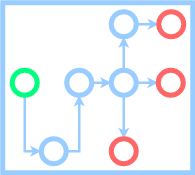

# Videoflow



[](https://github.com/videoflow/videoflow/blob/master/LICENSE)
[](https://videoflow.github.io/videoflow/index.html)

📖 **[Documentation](https://videoflow.github.io/videoflow/index.html)**

**Videoflow** is a Python framework for building **distributed** video and stream
processing pipelines. You describe your pipeline once as a directed acyclic graph
of producers, processors and consumers, and Videoflow runs it as a set of
independent workers that communicate over a [NATS JetStream](https://docs.nats.io/nats-concepts/jetstream)
message broker.

The same graph runs two ways with no code changes:

- **Locally**, as one OS subprocess per node — for fast development and testing.
- **On Kubernetes**, as one container per node — with per-node scaling, GPU
  scheduling, health probes and autoscaling for production.

It ships with off-the-shelf components for object detection, tracking, pose
estimation, segmentation and video I/O, is easy to extend with your own, and can
run [components written in any language](#language-agnostic-components) shipped as
container images.

---

## How it works

```
   ┌──────────┐      ┌───────────┐      ┌───────────┐      ┌──────────┐
   │ producer │─────▶│ processor │─────▶│ processor │─────▶│ consumer │
   └──────────┘      └───────────┘      └───────────┘      └──────────┘
        │                  │                  │                  │
        └──────────────────┴───── NATS JetStream ───────────────┘
                        (one stream per node)
```

- Each **node** is identified by a stable, unique `name` and runs in its own
  worker (subprocess locally, pod on Kubernetes).
- Every node publishes its output to its own broker subject; each node subscribes
  to the subjects of its real parents and reassembles its inputs. This makes
  arbitrary DAGs — multi-parent joins, multiple independent producers, fan-out —
  work naturally.
- A node's constructor arguments must be **JSON-serializable** so a worker can
  reconstruct just its one node from configuration. Expensive or stateful setup
  (opening a camera, loading a model) belongs in the node's `open()` method, not
  its `__init__`.

---

## Installation

Requires **Python 3.12+** and docker; a NATS JetStream server is needed at
runtime, and `run-local` starts one for you (see below). Videoflow is on
[PyPI](https://pypi.org/project/videoflow/):

```bash
pip install 'videoflow[all]'           # into an environment of your own
# or, as a standalone command on your PATH:
uv tool install 'videoflow[all]'
videoflow --help
```

The extras: `distributed` (broker client + wire format), `vision` / `video`
(OpenCV, ffmpeg), `deploy` (Kubernetes manifests, component descriptors), `blob`
(the Redis payload store), or `all`. That is the whole install: the
`videoflow-base` container image that solutions build on is pulled from
`ghcr.io/videoflow/videoflow-base:<your version>` the first time `deploy` or
`run-local` needs it, and the shipped solutions are fetched on demand (see
[Example solutions](#example-solutions)). Nothing is cloned or built by hand.
To work on videoflow itself, see [Developing videoflow](#developing-videoflow).

You do **not** need to start a broker by hand: `videoflow run-local` starts a dev
NATS + Redis in Docker when none is already running, and stops them when the flow
ends. To run one yourself instead (it will be detected and reused), either use the
included `docker-compose.yml` or a local binary:

```bash
docker compose up -d          # NATS JetStream on :4222, Redis on :6379
# or, without Docker:
nats-server -js
```

A dev store you run yourself keeps what a run that *failed* left in it: its
payloads stay pinned for their readers until the TTL (24 hours for a batch flow),
so the next run starts against a fuller store. `docker compose down && docker
compose up -d` gives you an empty one; the dev pair `run-local` starts itself is
removed when the flow ends, so it never carries anything over.

---

## Quickstart

A pipeline is defined inside a `build_flow()` factory that returns a `Flow`. The
same factory is used to run locally and to deploy to Kubernetes.

```python
from videoflow.core import Flow
from videoflow.core.constants import BATCH
from videoflow.producers import IntProducer
from videoflow.processors import IdentityProcessor, JoinerProcessor
from videoflow.consumers import CommandlineConsumer

def build_flow():
    producer  = IntProducer(0, 40, 0.1, name='producer')
    identity  = IdentityProcessor(name='identity')(producer)
    identity1 = IdentityProcessor(name='identity1')(identity)
    joined    = JoinerProcessor(name='joined')(identity, identity1)
    printer   = CommandlineConsumer(name='printer')(joined)
    # Producers are discovered automatically from the consumers — list only the leaves.
    return Flow([printer], flow_type=BATCH)

if __name__ == '__main__':
    from videoflow.engines.local import LocalProcessEngine
    flow = build_flow()
    flow.run(LocalProcessEngine())   # one subprocess per node, talking to NATS
    flow.join()
```

Run it:

```bash
videoflow run-local my_flow.py
```

That is the local twin of `deploy`: it generates the solution config if the graph
ships a `config.template.yaml`, runs its `prepare.py` hook, starts a dev broker if
none is listening, spawns one worker subprocess per node, waits for the flow to
finish, reports any node that exited non-zero, and stops only the containers it
started. Overrides: `--nats`, `--config`, `--no-prepare`, `--no-infra`,
`--keep-infra`, `--blob-redis-url`, `--blob-ttl-seconds`, `--run-id`,
`--require-profile CHANNEL=PROFILE` (see below).

Running the script directly still works when you have a broker up:

```bash
python my_flow.py
```

---

## Example solutions

[`solutions/`](solutions) holds four complete, deployable applications built
from core nodes only — no models, no footage, no extra dependencies. They are
the fastest way to see the whole path (config, prep hook, image, broker, workers,
teardown) actually work, and the best code to read after this README.

| Solution | Flow type | What it demonstrates |
|---|---|---|
| [toy_calculator](solutions/toy_calculator) | BATCH | A diamond over a stream of integers: fan-out, a trace join, competing replicas, stateful aggregation, a two-parent consumer. The smallest complete solution. |
| [toy_router](solutions/toy_router) | BATCH | Partitioned parallelism: `partition_by` pinning each key to one replica, an `async def process` node, an idempotent sink. |
| [toy_recovery](solutions/toy_recovery) | BATCH | The error taxonomy at work: a poison message dead-lettered on first sight, a crash restarted with its un-acked messages redelivered, a self-checking recovery report. |
| [toy_fusion](solutions/toy_fusion) | REALTIME | Independent producers fused by event time — tolerance, lateness timeout, quorum, collect windows — with unbounded live sources. |

```bash
videoflow run-local videoflow://toy_calculator     # or: videoflow deploy videoflow://toy_calculator
```

A `<repo>://<name>` argument is a solution shipped in one of the videoflow
repositories: `solutions/<name>` of `github.com/videoflow/<repo>`, fetched at
the tag matching your installed version — the repositories release in lockstep,
so `v1.2.0` of `videoflow://` and `videoflow-contrib://` go with videoflow
1.2.0. The first use makes one shallow clone into
`~/.videoflow/solutions/<repo>@v<version>/`, reused afterwards (`rm -rf` it to
refetch); the solution's `config.yaml` and its outputs live there, next to the
graph, exactly as they would in a checkout, and the path is printed on every
run. Pass `--config ./my.yaml` to keep the config (and the outputs its
`work_dir` names) somewhere of your own. From a checkout, the path form does the
same thing: `videoflow run-local solutions/toy_calculator/toy_calculator.py`.

Each writes a self-checking artifact (`report.json`, `counts.json`,
`recovery_report.json`, `fusion_summary.json`) saying whether the distributed
run computed the right answer — which is also how they serve as the framework's
end-to-end test suite, run on every CI build by
`tests/integration/local/test_toy_solutions.py`.

The ML solutions live in [videoflow-contrib](https://github.com/videoflow/videoflow-contrib)
(`solutions/face_obfuscation`, `solutions/human_tracking`) and run with the
same two commands. Their stacks (TensorFlow, torch, detectron2) are **not**
installed on your machine: `run-local` notices the graph does not import here,
builds the solution image from its Dockerfile — the same image `deploy` uses —
and runs the prepare hook and every worker inside it:

```bash
videoflow run-local videoflow-contrib://human_tracking   # builds the image (minutes, once); the workers are containers
videoflow deploy videoflow-contrib://human_tracking      # the same image, as pods
```

---

## Deploying to Kubernetes

On a dev cluster (k3s / kind / minikube / Docker Desktop), deploying is one
command:

```bash
videoflow deploy my_flow.py
```

`deploy` compiles the graph and renders one Deployment (or a Job, for finite
producers) plus a ConfigMap per node, every object named for the run
(`vf-<flow>-<run>-<node>`, selectors carrying the run label) so two runs of one
flow coexist in a namespace without overwriting each other — pass `--single-run`
to have a second run refused before anything of it is created instead — and by
default automates everything around that: it builds the node image from the `[gpu.]Dockerfile` next to your
graph (auto-building `videoflow-base` first when missing; `gpu.Dockerfile` when
the flow has GPU nodes — decided by the config keys the template names in
`x-gpu`, or by the compiled graph's device placement, never by whether *this*
machine's docker daemon has the NVIDIA runtime) and loads it into the
detected cluster flavor, provisions a dev NATS (+ Redis for the blob store) in
the namespace, applies the flow, and — for a BATCH flow — waits for completion
and tears down the run and the infra it created. Solutions can additionally ship
a `config.template.yaml` (deploy asks its questions interactively to generate
`config.yaml`) and a `prepare.py` hook (run inside the solution image before
compiling); when the graph's ML deps aren't installed on the operator machine,
deploy compiles the graph inside the image too. Local input files are exposed to
the pods with repeatable `--mount /abs/path[:ro]` hostPath mounts (solution
`x-mounts` are added automatically). Data that lives in the cluster rather than
on your machine — a shared model cache, an RWX work directory on a multi-node
cluster where no node's own filesystem holds it — is mounted from an existing
PersistentVolumeClaim with `--mount-pvc claim:/path[:ro]` (or an `x-mounts` entry
`pvc:claim:/path`); a `--mount` or `x-mounts` host path under that path is served
by the claim in the pods — at the same path, or, for a cache the template remaps
onto `/root/...`, as a `subPath` of the claim — and by the host in the prepare
container; `--mount-home DIR` re-roots the `~` of those cache entries so they can
live inside the claim's directory. On a shared cluster,
`--priority-class cluster-batch` puts every pod the deploy creates — workers,
provision Job and the broker it provisions — in that PriorityClass. The
auto-provisioned broker is dev-grade by default (one emptyDir server each: a
NATS file store and an append-only, never-evicting Redis that both live as long
as their pod — enough for BATCH and REALTIME flows alike, not for surviving a
pod loss); `--broker-profile durable` renders a NATS StatefulSet with cluster
routes and a PersistentVolumeClaim per pod plus the same Redis on a claim, sized
with `--broker-replicas N` (odd) and `--broker-storage-class NAME`. A broker the
namespace already runs is reused as it is (its Service records the profile that
rendered it; naming a different `--broker-profile` is refused rather than
silently served). Before anything is applied, deploy checks that the broker and
store it is about to use can actually provide what every channel asks for —
`reliable_work` for a BATCH flow, `live_latest` for REALTIME — and stops if not
(an evictable cache brought as the store of a BATCH flow, say — exit 2, nothing
applied). A broker deploy provisions is judged by its profile; a bring-your-own
`--nats` / `--blob-redis-url` is read back live, and what cannot be read is
reported as unknown rather than assumed: a warning, unless `--require-profile
CHANNEL=PROFILE` (the channel is the publishing node's name; profiles are
`live_latest`, `reliable_work`, `durable_control`, `replay_archive`) named the
guarantee, in which case an unobserved one is refused too — at deploy, again in
the provision Job before any stream is created, and in every worker before it
opens. The same flag on `run-local` checks the dev containers, which are judged
by the same dev profile. Three placement flags are
opt-in and change nothing when absent: `--rollout-policy drain|surge` decides
how a node's Deployment replaces its pods (`drain` stops the old replica before
the new one starts — what a GPU node needs when its devices cannot be held
twice; `surge` starts one extra replica first, and is refused up front when the
GPU pool has no spare device for it), `--gpu-nodes HOST,...` pins every GPU pod
to those hosts on top of the pool label, and `--resources NODE=cpu:500m,memory:1Gi`
(repeatable; `*` for every node; `cpu_limit`/`memory_limit` for limits) sets
the worker containers' host requests, over whatever a component's descriptor
declares in `spec.resources`.

An auto-built image is deployed under a **content-addressed tag**
(`videoflow-<solution>:<12 hex of its id>`, tagged beside the `:latest` that
keeps docker's layer cache warm), and every container is rendered with
`imagePullPolicy: IfNotPresent`. Together they are what makes both paths right
without a flag: a side-loaded image has nothing to pull, and on a registry a
changed image is a new tag, so no node ever keeps running last week's build.
Pass `--image-pull-policy Always` only for a registry image under a mutable tag
you re-push yourself.

Every automatic step has an explicit override — the fully manual path still
works:

```bash
# 1. Bring your own broker (use the NATS Helm chart in prod)
kubectl create namespace videoflow
kubectl apply -n videoflow -f k8s/nats.yaml

# 2. Build & push your image (your code + deps, FROM ghcr.io/videoflow/videoflow-base:<version>)
docker build -t ghcr.io/acme/app:v1 . && docker push ghcr.io/acme/app:v1

# 3. Deploy against that broker and image
videoflow deploy my_flow.py:build_flow \
    --nats nats://nats.videoflow.svc:4222 \
    --namespace videoflow \
    --image ghcr.io/acme/app:v1 \
    --autoscaling                             # optional KEDA scalers (REALTIME flows — a BATCH
                                              # flow's nodes are Jobs, which no scaler can scale,
                                              # so deploy refuses the flag for them)
```

Use `--dry-run` to print the manifests to stdout (including the dev-infra
manifests when `--nats` is omitted) — the prepare hook's output goes to stderr,
so stdout stays valid YAML, and nothing is pushed — or `--render-only` to write
them plus a `kustomization.yaml` for `kubectl apply -k` (that one pushes the
image when a `--registry` is set, since its output is meant to be applied). Other CLI commands:
`videoflow explain my_flow.py` (human-readable graph/topology summary),
`videoflow provision my_flow.py --nats ...` (create the broker streams up front),
`videoflow teardown --flow-id ... --run-id ... --nats ... [--namespace ...] [--infra]`
(stop a run and delete its streams and workloads — `--infra` also removes
auto-provisioned NATS/Redis), the
`videoflow dlq ls|show|replay|purge --flow-id ...` family for
[dead-lettered messages](#error-handling), `videoflow debug decode`
(decode wire envelopes from a file), and the
`videoflow component validate|push|pull|inspect` family for
[language-agnostic components](#language-agnostic-components).

Every command exits with a code that says what *kind* of thing went wrong, so CI
can triage without parsing stderr: `2` your flow or config, `3` your cluster or
broker, `4` the flow ran and nodes failed, `5` the flow stalled, `130`
interrupted. Errors print as a message and a fix rather than a traceback; set
`VF_DEBUG=1` when you want the traceback.

### Multi-node and shared clusters

A laptop cluster needs nothing above. A cluster with several nodes has two
things a single node hides — a locally built image side-loaded into one node's
containerd is invisible to the others, and a hostPath is a different directory
on every node — and a shared cluster usually has a namespace, a PriorityClass
and a set of GPU nodes that are yours. The answers are `--registry` (push the
image, let the nodes pull it; `--push-tool crane` for a plain-HTTP registry the
docker daemon does not trust), `--mount-pvc` (an RWX claim, mounted at the
directory it is served at, so every path the solution reads or writes lives on
it) with `--mount-home` (the caches too), and `--priority-class` /
`--gpu-nodes`. Those values belong to the cluster, not to a solution or a run,
so they live in a **cluster profile**, keyed by the kubectl context it describes:

```yaml
# ~/.config/videoflow/clusters.yaml   ($VF_CLUSTERS_FILE or --clusters-file to point elsewhere)
docker:                                # machine-level, for every docker build / run
  build_args: '--build-arg http_proxy=http://proxy:3128'
clusters:
  lab:                                 # `--cluster lab`, or matched by `context`
    context: default                   # the kubectl context this profile belongs to
    namespace: videoflow
    registry: 10.0.0.1:5000
    push_tool: crane
    mount_pvc: ['work-share:/shared/videoflow']
    mount_home: /shared/videoflow/home
    priority_class: cluster-batch
    gpu_nodes: [gpu-01]                # optional
    broker_profile: durable            # optional: broker + payload store on claims of
    broker_storage_class: nfs-shared   #   this class, not on the nodes' disks
    broker_replicas: 1                 #   (NATS servers; default 3)
```

With that file in place, `videoflow deploy human_tracking.py` on that context
is still one command: deploy says which profile it took its defaults from, a
flag typed on the command line always wins, and `teardown` reads the same
profile. Every key is a `deploy` flag with underscores; lists stand for
repeatable flags. The one thing the profile cannot do for you is choose where
the data goes: on such a cluster answer the `work_dir` question (and any input
path) with a directory under the claim's, so the pods and your machine see the
same files.

### Preparing a cluster with GPU access

A node declared with `device_type='gpu'` compiles to a pod spec with three things
in it — that's the whole contract the cluster has to satisfy:

```yaml
resources:
  limits: { nvidia.com/gpu: 1 }         # one GPU per replica
nodeSelector:
  videoflow.io/gpu-pool: "true"         # where GPU pods are allowed to land
tolerations:
  - key: nvidia.com/gpu                 # so a tainted GPU pool still accepts them
    operator: Exists
    effect: NoSchedule
```

So a cluster is GPU-ready for Videoflow when some node **advertises allocatable
`nvidia.com/gpu`** and **carries the `videoflow.io/gpu-pool=true` label**. Deploy
preflights exactly those two conditions for any flow containing a GPU node and
prints the fix for whichever is missing (as a warning — it does not block the
deploy, so the pods will simply sit `Pending`).
TODO: Why wouldn't it block the deploy? Isn't that whay we would wants, instead of having a node wait forever? (The philosophy behind videoflow is that it takes total control of the Kubernetes cluster.)

**1. Drivers and container runtime on the GPU hosts.** Each GPU node needs the
NVIDIA driver plus the NVIDIA container toolkit wired into its container runtime,
so containers can see the device. On managed clusters this is done for you by
picking a GPU node pool / GPU-enabled AMI; on your own machines:

```bash
# Ubuntu host
sudo apt-get install -y nvidia-driver-550 nvidia-container-toolkit
sudo nvidia-ctk runtime configure --runtime=containerd   # or --runtime=docker
sudo systemctl restart containerd
nvidia-smi                                               # driver visible on the host
```

**2. Expose the GPUs to Kubernetes** with the NVIDIA device plugin, which is what
turns a physical GPU into the schedulable `nvidia.com/gpu` resource:

```bash
kubectl apply -f https://raw.githubusercontent.com/NVIDIA/k8s-device-plugin/v0.16.2/deployments/static/nvidia-device-plugin.yml
```

On GKE/EKS/AKS use the provider's path instead (GKE installs the plugin via its
driver DaemonSet, EKS ships it in the GPU AMI, AKS via the GPU node pool). For a
bare-metal fleet, the [NVIDIA GPU Operator](https://docs.nvidia.com/datacenter/cloud-native/gpu-operator/latest/)
installs drivers, toolkit, plugin and monitoring in one Helm release and replaces
both step 1 and step 2:

```bash
helm repo add nvidia https://helm.ngc.nvidia.com/nvidia && helm repo update
helm install --wait gpu-operator nvidia/gpu-operator -n gpu-operator --create-namespace
```

**3. Label the GPU nodes** so Videoflow's nodeSelector matches:

```bash
kubectl label node <gpu-node> videoflow.io/gpu-pool=true
# or label a whole managed pool at once:
kubectl label node -l cloud.google.com/gke-accelerator videoflow.io/gpu-pool=true
```

Optionally **taint** the pool so CPU-only workloads keep off the expensive
machines — the generated pods already tolerate exactly this taint:

```bash
kubectl taint node <gpu-node> nvidia.com/gpu=present:NoSchedule
```

**4. Verify** before deploying anything:

```bash
kubectl get nodes -l videoflow.io/gpu-pool=true                                   # non-empty
kubectl get nodes -o jsonpath='{.items[*].status.allocatable.nvidia\.com/gpu}'    # e.g. "1 4"
kubectl run gpu-smoke --rm -it --restart=Never --image=nvidia/cuda:12.4.1-base-ubuntu22.04 \
    --overrides='{"spec":{"nodeSelector":{"videoflow.io/gpu-pool":"true"},"tolerations":[{"key":"nvidia.com/gpu","operator":"Exists","effect":"NoSchedule"}],"containers":[{"name":"gpu-smoke","image":"nvidia/cuda:12.4.1-base-ubuntu22.04","command":["nvidia-smi"],"resources":{"limits":{"nvidia.com/gpu":1}}}]}}'
```

If `nvidia-smi` prints the device table from inside that pod, the cluster is
ready — a Videoflow GPU node schedules under identical constraints. (CUDA 12.4
images are published for Ubuntu 22.04, not 24.04; 24.04 variants start at CUDA
12.6.)

**The GPU must reach the container, not just the pod.** The device plugin only
makes `nvidia.com/gpu` *schedulable*; injecting the device into a container is
the job of the NVIDIA container runtime. That works out of the box only when the
node's container runtime uses it **by default**. Distributions that instead
register it as an opt-in `RuntimeClass` — k3s is the notable one, exposing
handlers named `nvidia` and `nvidia-experimental` — will happily schedule a GPU
pod that then finds no device. Deploy handles this for you: for a flow with GPU
nodes it looks for the NVIDIA RuntimeClass the cluster registers and puts it on
the GPU pods, announcing the choice. Name one yourself, or opt out, when you know
better:

```bash
videoflow deploy my_flow.py --gpu-runtime-class nvidia-legacy   # a specific handler
videoflow deploy my_flow.py --gpu-runtime-class none            # no runtimeClassName at all
```

`--gpu-runtime-class` puts `runtimeClassName` on GPU pods only; CPU nodes are left
on the node's default runtime. Deploy's preflight still warns when an `nvidia`
RuntimeClass exists and none ended up on the pods (you opted out), since that
combination is the one that silently produces device-less GPU pods.

Making the nvidia runtime the node's containerd *default* also works and needs no
flag, but it routes every pod through the NVIDIA shim — and that has a sharp edge.
Unless `accept-nvidia-visible-devices-envvar-when-unprivileged = false` is set in
`/etc/nvidia-container-runtime/config.toml` (it defaults to **true**), any container
whose image sets `NVIDIA_VISIBLE_DEVICES=all` receives every GPU on the node,
without requesting `nvidia.com/gpu` and without the device plugin accounting for it.
Every `nvidia/cuda:*` image sets that variable, `videoflow-base:py3.12-cuda`
included — so a flow deployed with a single `--image` pointing at a CUDA image would
hand full GPU access to its `device_type='cpu'` nodes. Prefer the per-deploy flag; if
you do change the node default, set the hardening option at the same time.

The leak is easy to observe: a pod with `runtimeClassName: nvidia` and **no**
`nvidia.com/gpu` limit still sees every GPU on the node. What keeps Videoflow's pods
honest is that the class is attached only to `device_type='gpu'` nodes, which always
carry a limit — the device plugin's allocation then pins each replica to the GPU it
was actually granted. Attaching the runtime to pods that request no GPU is precisely
what you want to avoid, which is why `--gpu-runtime-class` never touches CPU nodes.

The device plugin's own DaemonSet needs the same treatment: if its logs say
`No devices found. Waiting indefinitely.`, it is running under the default runtime
and needs `runtimeClassName: nvidia` patched onto its pod spec.

**5. Build the node image on the CUDA base.** GPU scheduling only gets the device
into the pod; the image still has to contain a CUDA-enabled stack. Videoflow ships
a CUDA variant of its base image (`ghcr.io/videoflow/videoflow-base:<version>-cuda`),
and `deploy` prefers a `gpu.Dockerfile` next to your graph whenever the flow has
GPU nodes:

```dockerfile
# gpu.Dockerfile, next to my_flow.py
FROM ghcr.io/videoflow/videoflow-base:1.0.2-cuda
RUN pip install torch --index-url https://download.pytorch.org/whl/cu124
COPY . .
RUN pip install .
```

Which of the two files deploy builds is the flow's decision, not the docker
daemon's: a solution names the config keys that select the device in its
`config.template.yaml` (`x-gpu: ['{device}']`), and without that deploy reads
the compiled graph's device placement when the graph imports on your machine.

Keep the image's CUDA minor version compatible with the host driver — a driver
too old for the image's CUDA runtime is the most common cause of a pod that
schedules onto a GPU and then dies with a CUDA initialization error. Deploy
catches this instead of reporting success: for a REALTIME flow it waits for
every pod to become Ready and, on a crash-loop or OOM kill, dumps the pod logs
and exits non-zero (the flow is left running for inspection).

**6. Deploy.** Nothing GPU-specific is needed on the command line; the device
requests come from the graph:

```bash
videoflow deploy my_flow.py --namespace videoflow          # dev: builds gpu.Dockerfile, provisions NATS
kubectl get pods -n videoflow -o wide                      # GPU pods land on the labeled nodes
```

**7. Optional — time-slicing, to fit more GPU nodes than you have GPUs.** Steps
1-6 are enough to run GPU flows; this step is what makes a graph with *several*
GPU nodes schedulable on one card. The device plugin advertises each physical GPU
as N schedulable units, so N pods co-schedule onto it. Nothing is partitioned:
every one of those pods gets the same physical device and draws from the same
VRAM pool — this is scheduler bookkeeping plus driver time-slicing, not isolation.

For more documentation on this, look [here.](https://docs.nvidia.com/datacenter/cloud-native/gpu-operator/latest/gpu-sharing.html) Some notes: time-slicing can be applied to specific GPUs. Time-slicing and MIG can be combined in one cluster.

```yaml
# nvidia-plugin-configs.yaml
apiVersion: v1
kind: ConfigMap
metadata: {name: nvidia-plugin-configs, namespace: kube-system}
data:
  config.yaml: |
    version: v1
    sharing:
      timeSlicing:
        renameByDefault: false          # keep the name nvidia.com/gpu
        failRequestsGreaterThanOne: true
        resources:
          - name: nvidia.com/gpu
            replicas: 4                 # size this from measured VRAM (see below)
```

```bash
kubectl apply -f nvidia-plugin-configs.yaml
# Point the plugin at it with a *strategic* merge patch (the default — do NOT pass
# --type=merge, which replaces the containers array wholesale and drops the image,
# the existing env, and runtimeClassName: nvidia from step 4).
kubectl -n kube-system patch ds nvidia-device-plugin-daemonset -p '{"spec":{"template":{"spec":{
  "containers":[{"name":"nvidia-device-plugin-ctr","env":[{"name":"CONFIG_FILE","value":"/config/config.yaml"}],
  "volumeMounts":[{"name":"plugin-config","mountPath":"/config"}]}],
  "volumes":[{"name":"plugin-config","configMap":{"name":"nvidia-plugin-configs"}}]}}}}'
kubectl -n kube-system rollout restart ds/nvidia-device-plugin-daemonset

kubectl get node <gpu-node> -o jsonpath='{.status.allocatable.nvidia\.com/gpu}'   # 1 -> 4
```

`renameByDefault: false` keeps the resource named `nvidia.com/gpu`, so **no
Videoflow change is needed** — the same manifests just schedule. Time-slicing
supports `gpu_count = 1` nodes only: the units are shares of one card, so a
multi-device grant is meaningless against them (`failRequestsGreaterThanOne:
true` rejects it cluster-side, and deploy's preflight hard-errors first, reading
the GPU Feature Discovery labels). The same logic applies to MIG: slices are
hardware-isolated partitions, so a model can never span two of them. A model
that needs multiple GPUs needs whole exclusive devices (see below).

**Size `replicas` from measured VRAM, not by guessing.** Time-slicing hands out
scheduling slots, not memory: co-tenants share the whole 24 GB (or whatever the
card has), and exceeding it is a runtime CUDA OOM inside a pod, not a clean
`Pending` you can see coming. There is no fault isolation either, and the node now
advertises more GPUs than it physically has — which will puzzle anyone reading
`kubectl get node` cold. Measure a single-camera/single-stream run with
`nvidia-smi --query-gpu=memory.used --format=csv -l 1` and divide.

To revert: `kubectl -n kube-system delete cm nvidia-plugin-configs`, remove the
`CONFIG_FILE` env and `plugin-config` volume/mount from the DaemonSet, then
rollout restart. See [`docs/source/distributed/gpu-sharing.rst`](docs/source/distributed/gpu-sharing.rst)
for MPS (hard per-client memory caps), MIG, and the full comparison.

**Single-node dev clusters.** k3s works well for this: it uses containerd, so
after step 1 it detects the NVIDIA runtime automatically and registers it as an
`nvidia` RuntimeClass — not as the default, which is exactly the case deploy
detects and handles by putting that class on the GPU pods. Then apply the
device plugin and label the single node. minikube needs `minikube start
--driver=docker --container-runtime=docker --gpus all`. kind has no supported GPU
passthrough — use k3s or a remote cluster instead.

**When GPU pods stay `Pending`**, `kubectl describe pod <pod> -n videoflow` names
the reason directly: `didn't match Pod's node affinity/selector` means the label
from step 3 is missing, `Insufficient nvidia.com/gpu` means the device plugin
(step 2) isn't running or every GPU is already claimed — a GPU is allocated
exclusively, so `nb_tasks` above the node's allocatable count (physical GPUs, or
the advertised units when time-slicing from step 7 is on) leaves the extra
replicas unschedulable.

**More GPU nodes than GPUs.** Locally each GPU worker gets its own
`CUDA_VISIBLE_DEVICES` block, wrapping around (with a warning) when there are more
claims than devices; on Kubernetes each GPU replica claims a whole exclusive device, so a
graph with N GPU nodes needs N allocatable GPUs — the rest stay `Pending` and the
flow stalls. Videoflow surfaces this instead of hanging: `videoflow explain`
prints the flow's GPU demand, deploy's preflight compares it against the cluster
(exit non-zero with `--strict-preflight`), and the BATCH wait loop aborts with an
actionable error when a pod is unschedulable. To actually run such a flow on a
small box: cut demand (run trackers/light stages on CPU), or enable device-plugin
**time-slicing** (step 7 — advertise each GPU as N units; no videoflow changes
needed). On MIG-capable hardware, `--gpu-mode mix` shares cards with hard memory
isolation instead: nodes declare `gpu_memory_gib` and the deploy solves a MIG
layout for them (see below). `--gpu-resource-name` covers clusters whose whole
devices are advertised under another name (`amd.com/gpu`); see
`docs/source/distributed/gpu-sharing.rst` for the full recipes.

**Models larger than one GPU.** A node whose model doesn't fit on one device asks
for more with `gpu_count`:

```python
captioner = VlmCaptioner(device_type = GPU, gpu_count = 2, name = 'captioner')(frames)
```

The pod then requests `nvidia.com/gpu: 2` and Kubernetes grants both whole
devices to that one worker, on one host. Inside the worker the contract is
simple: **the visible GPUs are exactly the granted GPUs, `cuda:0..N-1`, with
`N == gpu_count`** — true on Kubernetes (device plugin) and under `run-local`
(the engine partitions `CUDA_VISIBLE_DEVICES`; by UUID, so the identity of each
device survives renumbering). When a host has fewer devices than the flow asks
for, `run-local --gpu-policy strict` refuses to start rather than hand out
short grants; the default `shared` policy lets workers share devices (fine for
development) and tells each worker the grant it really got
(`VF_GPU_GRANT_JSON`, the delivered device list, marked non-exclusive). A node
that cannot run short says so with `gpu_fallback = 'none'`, and one whose
execution path needs peer access between its devices with
`requires_peer_access = True`; the worker checks both against the real grant
before the node opens. How the model spreads across
them is the node's own `open()`: `device_map='auto'` for Hugging Face models,
a `tensor_parallel_size` for engines that take one, or explicit `.to('cuda:1')`
placement for multi-model nodes. A component can declare its need in its
`component.yaml` (`spec: {resources: {gpu: {count: 2}}}`) so graph authors don't
have to pass `gpu_count=` by hand. Two things to know: all `gpu_count` devices
must fit on **one** cluster node (preflight checks the largest node, not just the
total — and then packs every pod's claim onto the per-node free counts, because
two nodes with 3 free GPUs each hold only two of three `gpu_count = 2` replicas
even though both aggregate checks pass; prefer NVLink-connected GPUs for tensor
parallelism), and sliced GPUs don't qualify (MIG, time-sliced and MPS units
can't be combined into one model — preflight hard-errors on the attempt). A
preflight whose occupancy read the API refused says so (`unobservable GPU
state`) rather than assuming the pool is idle; under `--gpu-mode mix` that is
fatal, since mix repartitions cards on the strength of it.

**Sharing GPUs with isolation: `--gpu-mode mix`.** On MIG-capable hardware
(A30/A100/H100), a flow can mix models that share a card with models that span
several. Nodes that state their memory demand become **sharers**; nodes that
don't (or that set `gpu_count > 1`) get whole physical devices:

```python
detector  = Detector(device_type = GPU, nb_tasks = 4, gpu_memory_gib = 10)(frames)   # 4 x 10 GiB slices
captioner = VlmCaptioner(device_type = GPU, gpu_count = 2)(frames)                   # 2 whole GPUs
```

Deploying with `--gpu-mode mix` solves a card layout against the pool's
inventory (from GPU Feature Discovery labels; only nodes labeled
`videoflow.io/gpu-pool=true` — the nodes the pods can schedule on): whole cards
are reserved for the spanners, the sharers are packed into MIG slices of the
smallest fitting profile (each an *exclusive* slice — the card is shared, the
slice is not, with hard memory/fault isolation), and the geometry is applied
through the GPU Operator's MIG manager: videoflow merges its generated
`nvidia-mig-parted` entries into the operator's current config, points
ClusterPolicy `migManager.config.name` at the merged copy for the run, and
restores both the policy and each node's previous `nvidia.com/mig.config` label
at teardown. The pool is treated as multi-tenant: nodes another flow claimed
(stamped `videoflow.io/gpu-owner=<flow-id>`), nodes with devices held by
running pods, and time-sliced or already-MIG'd nodes are excluded from
planning, capacity checks count only *free* units, concurrent flows split the
pool at node granularity, and only the last flow out restores the operator
config (`videoflow teardown --flow-id <id> --gpu-mode mix` reverts just that
flow's nodes). Without the MIG manager (or its ClusterPolicy), deploy prints
the exact `nvidia-mig-parted` config to apply by hand. `gpu_memory_gib` and
`gpu_count > 1` are mutually exclusive on one node — a model can never span MIG
slices, so a node declares either a fraction of one device or whole devices.
Under every other mode `gpu_memory_gib` is simply unused (the node gets a whole
device), so a mix-authored flow still deploys anywhere — except on a pool node an
administrator carved statically (`nvidia.com/mig-*` advertised), where the default
mode consumes a free slice as advertised and never repartitions. Readiness is
observed, not read off a label: a node counts as prepared only once the MIG
manager reports success **and** advertises the requested slices, and teardown
reverts a node only once it advertises whole cards again with no slice left on
offer (the manager reports success before the device plugin it restarted is
back) and no pod still holds one of its slices. `--gpu-mode dra` renders Dynamic Resource
Allocation claims (`ResourceClaimTemplate`s and the pod references of
`resource.k8s.io/v1`) for a cluster with a GPU DRA driver; without one deploy
stops at preflight, and the claim lifecycle itself is not managed by videoflow
in this release.

### How graph concepts map onto the broker and Kubernetes

| Concept | Behavior |
| --- | --- |
| `flow_type=REALTIME` | broker keeps only the freshest message per edge — stale frames are dropped, producers never block |
| `flow_type=BATCH` | **at-least-once, loss-free** delivery: interest-retention streams bound the backlog and apply real backpressure (a full stream, or a full payload store, blocks the publisher instead of dropping) |
| `ProcessorNode(nb_tasks=N)` | N competing-consumer replicas (Deployment replicas, each claiming a replica slot through the run ledger at start; an Indexed Job of N completions in a BATCH flow) |
| `ProcessorNode(nb_tasks=N, partition_by=...)` | N **partitioned** replicas (StatefulSet); each message is owned by one replica by key hash — this is how a multi-parent **join can scale** (`partition_by='trace_id'`) |
| `device_type=GPU` | pod requests `gpu_count` × `nvidia.com/gpu` (or `--gpu-resource-name`) plus a GPU-pool nodeSelector/toleration — exclusive whole physical devices; under `--gpu-mode mix`, nodes with `gpu_memory_gib` request a solver-chosen exclusive MIG slice instead |
| finite `ProducerNode` (`is_finite=True`) | Kubernetes **Job**; infinite/streaming producers and all other nodes are **Deployments** |
| `flow.stop()` | publishes on a control channel every worker subscribes to, then tears the workloads down |
| observability | each worker exposes `/metrics` (Prometheus — latency histograms, throughput and drop counters, errors by code) and `/readyz` + `/healthz` + `startupProbe`; `--autoscaling` adds KEDA scalers on broker lag to REALTIME processors |

### Reliability

Every run is scoped by a **`run_id`**, so re-running or redeploying a flow gets a
fresh set of streams instead of colliding with the previous run.

Delivery is **at-least-once with ack-after-process**: a worker acknowledges a
message to the broker only after it has processed it (and published its output), so
a crash mid-processing causes redelivery, not loss. Content-derived message ids give
the broker publish-dedup, so the retry after a crash doesn't double-emit.

<a name="error-handling"></a>
What happens to a *failed* message depends on **why** it failed, not just on the
flow type:

| The failure means | What videoflow does |
|---|---|
| the **message** is bad (`SchemaError`, a decode failure) | dead-letter it on the first attempt — retrying something that failed on its own content cannot help |
| the **world** blipped (`UpstreamUnavailable`, a timeout) | retry with jittered backoff, then dead-letter |
| this **worker** is sick (`DeviceError`, out of memory) | hand the message back for a healthy replica, never blame it, and stop the worker |

An exception you do not classify is treated as the middle case, so nothing changes
until you opt in. Workers also protect themselves: a run of unexplained failures
trips a circuit breaker, and a node that stops acking while work is pending is
declared stalled rather than hanging the run forever — checked between messages
by the run loop and, from a watchdog thread every `VF_WATCHDOG_INTERVAL_SECONDS`
(default 5; `0` disables the thread), *during* a `process()` that never returns,
so a wedged callback with healthy broker heartbeats is still caught and the
reason lands in the pod's termination message.

Dead letters land on the flow's DLQ stream (`vf-<flow>-dlq`) with the error code
attached. It is scoped to the flow, not the run, so tearing a run down does not
delete the record of what it lost — and `videoflow dlq replay` puts the messages
back once the bug is fixed.

When a node dies, it says so: an **abort** marker propagates through the graph the
way end-of-stream does, so a dead producer ends its descendants instead of leaving
them blocked forever. Crashed workers are restarted — three attempts in Kubernetes
via the Job `backoffLimit`, and the same three locally, so a crash the cluster
absorbs is absorbed in development too.

Multi-parent **joins** support timeout + missing-input policies (drop / wait /
error) so a stalled or dropped branch can't hang the join forever. End-of-stream is
**replica-safe**: every replica of a node observes it and drains its inputs before
terminating.

The full model — dispositions, the retry ladder, restarts, the dead-letter queue
and the exit codes — is in
[Error handling and recovery](https://videoflow.github.io/videoflow/user-documentation/error-handling-and-recovery.html),
and `solutions/toy_recovery` is a runnable demonstration of it.

### Time-synchronized joins (fusing independent streams)

By default a join groups inputs by **lineage** — halves that descend from the same
originating message of one producer (a diamond that fans out and reconverges). To
fuse streams from *independent* producers — several cameras plus sensors, none
sharing an upstream — group by **event time** instead:

```python
from videoflow.core.policies import JoinPolicy

fused = FusionProcessor(name='fuse', join_policy=JoinPolicy(
    mode='time',            # group by event_ts, not trace lineage
    tolerance_ms=8,         # messages within 8ms are the same moment (< one 60fps frame)
    timeout_seconds=0.05,   # lateness bound: how long to wait for stragglers
    quorum=6,               # emit once ≥6 of N cameras are present (missing ones → None)
    collect={'imu': 25},    # high-rate parent: deliver every sample within 25ms as a list
))(cam1, cam2, cam3, cam4, cam5, cam6, cam7, cam8, imu)
```

Each input carries an **event timestamp** (epoch seconds) that a producer stamps and
that travels with the message through the whole flow (downstream nodes inherit it
automatically). Producers stamp it via `ctx.set_event_timestamp(ts)`; the built-in
`VideostreamReader` does this per frame (`timestamp_source='clock'` for live streams,
`'position'` for synchronized recordings). A fusion node reads each input's exact
time from `ctx.input_info` (per-parent `event_ts`/`metadata`) to interpolate between
samples. Cross-device time accuracy itself is an ops concern — genlocked cameras and
PTP/NTP-disciplined hosts — the framework aligns on whatever timestamps it's given.

A time-aligned join runs with `nb_tasks=1` (every parent's half must reach the same
worker to be grouped); scale the per-stream work in the nodes *upstream* of the
fusion node instead.

**Backward compatibility.** `mode='trace'` is the default and never reads
`event_ts`, so existing flows — including ones whose producers stamp no time at
all — behave exactly as before. A producer that never calls
`ctx.set_event_timestamp` still gets an event time on the wire: its publish
wall-clock, which is ignored by trace-mode joins and serves as a sensible fallback
if such a stream is later fed into a `mode='time'` join.

---

## The three node types

| Type | Base class | Implements | Role |
| --- | --- | --- | --- |
| Producer | `ProducerNode` | `next()` | Creates data from an external source (camera, file, stream). Set `is_finite=False` for unbounded sources. |
| Processor | `ProcessorNode` | `process(*inputs)` | Transforms inputs into an output. Supports `nb_tasks` (parallel replicas) and `device_type` (`cpu`/`gpu`). |
| Consumer | `ConsumerNode` | `consume(item)` | Terminal sink — writes to a file, pushes to a REST API/S3, etc. Produces no output. |

Every node also has `open()`/`close()` lifecycle hooks for acquiring and releasing
resources.

### Writing a custom node

```python
from videoflow.core.node import ProcessorNode

class Threshold(ProcessorNode):
    def __init__(self, cutoff, **kwargs):   # args must be JSON-serializable
        self._cutoff = cutoff               # store them so get_params() can find them
        super().__init__(**kwargs)

    def open(self):
        ...                                 # heavy/stateful setup goes here

    def process(self, value):
        return value if value >= self._cutoff else 0
```

Always accept and forward `**kwargs` to `super().__init__()` (that's how `name`,
`nb_tasks`, `device_type`, etc. are passed through), and store each constructor
argument on `self` under the same name so it can be captured for reconstruction in
a worker.

Nodes can also:

- **Be async** — declare `async def process(self, value)` (or `next`/`consume`);
  the worker awaits it without blocking broker I/O.
- **Receive a runtime context** — add a final `ctx` parameter to any lifecycle or
  processing method (`def process(self, value, ctx=None)`) to read `ctx.run_id` /
  `ctx.node_name` / `ctx.replica_id` or call `ctx.set_partition_key(k)` to route the
  output of a downstream partitioned node by a business key.
- **Deduplicate sink effects** — `ConsumerNode(idempotent=True)` plus a Redis URL
  (`--blob-redis-url`) makes a sink skip re-applying an effect on redelivery.
- **Pin their own container image** — pass `image='ghcr.io/me/gpu:v1'` when a node
  intrinsically needs a specific environment; otherwise it uses the deploy's
  `--image` default. See [Container images](#container-images).

---

## Container images

You bring the image. Videoflow publishes one **base** image per release
(framework + broker client + the built-in nodes' dependencies — OpenCV, ffmpeg,
Redis): `ghcr.io/videoflow/videoflow-base:<version>` (amd64 and arm64) and
`:<version>-cuda` (CUDA 12.6 + cuDNN, for GPU nodes). You build **your** image
on top of it with your dependencies and your node package, then point the
deploy at it:

```dockerfile
# Dockerfile (see docker/user-image.example.Dockerfile)
FROM ghcr.io/videoflow/videoflow-base:1.0.2   # pin the version you installed
RUN pip install torch my-libs        # your deps
COPY . .
RUN pip install .                    # your package, importable by its module path
```

```bash
docker build -t ghcr.io/me/app:v1 .      # your image, FROM videoflow-base

videoflow deploy my_flow.py:build_flow --nats nats://... --image ghcr.io/me/app:v1
```

A solution that ships its Dockerfile next to the graph does not need any of
this: `deploy` and `run-local` build it, deploy it under a content-addressed
tag, and push it when a `--registry` is set. Its Dockerfile is `FROM
videoflow-base:py3.12` (or `-cuda`), the local name; when that image is
missing, `deploy` pulls the published one for your version and tags it so — or,
on a source install, builds it from your checkout, so local core changes reach
the workers (see [Developing videoflow](#developing-videoflow)).
`VF_BASE_IMAGE_REGISTRY` points the pull at a mirror instead of
`ghcr.io/videoflow`. Two more environment variables reach every docker command
they run — `VF_DOCKER_BUILD_ARGS` for each `docker build` and
`VF_DOCKER_RUN_ARGS` for each `docker run` (a corporate proxy as `--build-arg
http_proxy=...`, say); the `docker` section of the cluster profile file sets
them for a machine. Contrib components name their GPU variant `gpu.Dockerfile`.

`--image` is the default for every node. A node that needs a different environment
declares its own image in the graph — `MyDetector(name='det', image='ghcr.io/me/gpu:v1')`
— or is overridden at deploy time with `--image-override det=ghcr.io/me/gpu:v1`
(override wins over the node's own image, which wins over `--image`). A pure built-in
flow can just use `--image ghcr.io/videoflow/videoflow-base:1.0.2`.

---

## Language-agnostic components

A node doesn't have to be Python. Videoflow defines a **language-agnostic wire and
runtime contract** so a component can be written in any language, shipped as its own
container image, and dropped into a Python-authored graph by reference — the basis
for a component **marketplace**.

The Python process only ever *builds and compiles* the graph; a remote component's
`next`/`process`/`consume` run out-of-process in the vendor image, driven by that
image's own SDK speaking the protocol. You wire one in with the `component()` factory
instead of importing a class:

```python
from videoflow.core import Flow, component
from videoflow.core.constants import BATCH

def build_flow():
    reader  = component('oci://ghcr.io/acme/camera-reader:1.0.0',
                        params={'address': 'rtsp://…'}, name='reader')
    tracker = component('oci://ghcr.io/acme/sort-tracker:1.2.0',
                        params={'max_age': 30})(reader)      # a Rust/C++/… node
    sink    = component('./my-consumer')(tracker)            # a local descriptor dir
    return Flow([sink], flow_type=BATCH)
```

A remote node behaves like a normal Producer/Processor/Consumer for wiring,
validation, scaling (`nb_tasks`, `partition_by`), and manifest generation; the
compiler records a `component_ref` + descriptor instead of a Python class.

### Component descriptors

A component is described by a `component.yaml` (validated against
[`spec/descriptor/component-schema.json`](spec/descriptor/component-schema.json))
that declares its params, inputs/outputs, device support, protocol version, and the
container image(s) to run. A descriptor with a `spec.runtime.pythonClass` names a
Python node the worker imports directly; without one it's a **native** component that
runs its own image entrypoint. Validate any descriptor before shipping it:

```bash
videoflow component validate ./sort-tracker/component.yaml
```

### Publishing and consuming (OCI)

Descriptors are distributed as **OCI artifacts** (media type
`application/vnd.videoflow.component.v1+yaml`) alongside the images they reference, so
a consumer can inspect a component's contract without pulling multi-gigabyte ML
images. An `oci://` ref in `component()` is pulled and cached under
`~/.videoflow/components/` automatically.

```bash
videoflow component push    ./sort-tracker oci://ghcr.io/acme/sort-tracker:1.2.0
videoflow component inspect oci://ghcr.io/acme/sort-tracker:1.2.0   # params/io, no images
videoflow component pull    oci://ghcr.io/acme/sort-tracker:1.2.0 --verify   # cosign
```

See [`spec/DISTRIBUTION.md`](spec/DISTRIBUTION.md) for the reference grammar and
publishing model.

### The wire protocol and spec

Every flow runs over one language-neutral **protobuf envelope (wire v4)** with
well-known payload types (`Tensor`, `Frame`, `Detections`, `Tracks`, `BlobRef`,
`Value`). A `Value` may nest a `Tensor`, so a mixed container such as a
`(frame_index, frame)` tuple is carried without any Python-specific codec. A payload
type with no built-in encoding registers one with `register_payload_encoder`;
arbitrary Python objects are never put on the wire (see
[`spec/rfcs/0001`](spec/rfcs/0001-v4-only-wire.md)).

The normative contract lives in [`spec/`](spec/):
[`spec/PROTOCOL.md`](spec/PROTOCOL.md) (protocol v1 — every requirement an SDK must
implement, with stable IDs), the protobuf IDL under `spec/proto/videoflow/v1/`, and
golden test vectors in `spec/vectors/` replayed against every SDK to enforce
lockstep. A vendor can hand-write a conforming component against the spec today; the
Python worker is the executable reference implementation.

The same idea applies one layer down. The transport, payload store, accelerator
allocator and runtime that sit under a flow have explicit contracts in
[`videoflow/backends/`](videoflow/backends) with in-memory reference
implementations, and a 130-case **backend conformance suite** under
[`tests/conformance/`](tests/conformance) (`uv run pytest tests/conformance -q -rs`,
then `uv run python tests/conformance/report.py`) that a new backend is developed
against. A case whose fixture is absent reports `NOT_RUN`, never a green skip. The
wire- and routing-observable parts of that work — per-replica terminator counts,
source-epoch ids, owner-labelled streams, payload obligations, the runtime ledger,
run-scoped Kubernetes names — are
[`spec/rfcs/0006`](spec/rfcs/0006-backend-contracts-and-runtime-ledger.md), accepted
in September 2026 and normative in [`spec/PROTOCOL.md`](spec/PROTOCOL.md).

---

## Developing videoflow

Everything above is for *using* videoflow from PyPI. To work on the framework
itself, install it from a clone instead — next to
[videoflow-contrib](https://github.com/videoflow/videoflow-contrib), which is
the layout the two repositories' docs and tooling assume:

```bash
git clone https://github.com/videoflow/videoflow
git clone https://github.com/videoflow/videoflow-contrib      # side by side

uv tool install --editable './videoflow[all]'                # `videoflow` on your PATH, from this checkout
# or, into an environment of your own:
python3 -m venv .venv && .venv/bin/pip install -e './videoflow[all]'
# or, with the dev tools (pytest, ruff, mypy, pre-commit):
cd videoflow && uv sync && uv run videoflow --help
```

A source install changes one thing: when `deploy` or `run-local` need a
`videoflow-base` image that is not built, they **build it from this checkout**
(`docker/base/Dockerfile[.gpu]`) instead of pulling the published one, so the
code you are editing is what runs in the workers. `docker rmi
videoflow-base:py3.12` after a core change forces that rebuild; the solution
images on top of it are content-addressed and rebuild on their own.
`./docker/build-images.sh` builds both bases by hand, and
`./docker/build-images.sh ghcr.io/videoflow 1.2.0` produces exactly the tags the
release publishes (the `Publish to PyPI` workflow does this for every release;
this is the manual form). From a checkout, run the solutions by path —
`videoflow run-local solutions/toy_calculator/toy_calculator.py` — or keep the
`<repo>://` form with `VF_SOLUTION_REF=master` when your version has no release
tag yet.

The unit tests need nothing but the checkout (`uv run pytest
--ignore=tests/integration -q`); the integration tiers, the kind cluster
scripts and the pre-commit hooks are described in
[How to contribute](docs/source/first-steps/how-to-contribute.rst).

## Contributing

A tentative [roadmap](ROADMAP.md) of where we are headed, and the
[contribution rules](CONTRIBUTING.md). New processors, producers or consumers
that pull in additional third-party dependencies belong in the
[videoflow-contrib](https://github.com/videoflow/videoflow-contrib) project — we
keep the core framework lean.

## Citing Videoflow

If you use Videoflow in your research please use the following BibTeX entry.

```
@misc{deArmas2019videoflow,
  author =       {Jadiel de Armas},
  title =        {Videoflow},
  howpublished = {\url{https://github.com/videoflow/videoflow}},
  year =         {2019}
}
```
