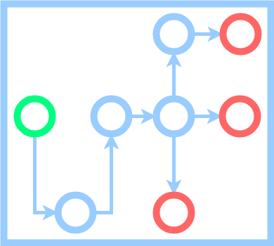

videoflow's documentation
=========================

.. meta::
   :description lang=en: video processing, video analytics framework, object detection, object tracking.

**Videoflow** is a Python framework for video stream processing. The library is designed to facilitate easy and quick definition of computer vision stream processing pipelines. It empowers developers to build applications and systems with self-contained Deep Learning and Computer Vision capabilities using simple and few lines of code.  It contains off-the-shelf reference components for object detection, object tracking, human pose estimation, etc, and it is easily extensible with your own.

Developer friendly
    Even complex flow applications can be defined in a simple file with less than 20 lines of code.

Automatic synchronization of resources
    You only have to define flow as a computation graph. The framework automatically allocates the resources for the computation and takes care of the synchronization among them.

Easy to extend
    It is very easy to create your own components and add them to the **flow**. 

Free and open source
    **Videoflow** is free and open source.  It uses the MIT License, which means you can mostly do anything with it.

.. toctree::
    :maxdepth: 2
    :hidden:
    :caption: First steps

    first-steps/installing-videoflow
    first-steps/getting-started-with-videoflow
    first-steps/how-to-contribute

.. toctree::
    :maxdepth: 2
    :hidden:
    :caption: Tutorials

    user-documentation/writing-your-own-components
    user-documentation/batch-versus-realtime-mode
    user-documentation/task-allocation
    user-documentation/advanced-flowing
    user-documentation/common-patterns
    user-documentation/debugging-flow-applications

.. toctree::
    :maxdepth: 2
    :hidden:
    :caption: Computer vision recipes

    computer-vision-recipes/object-tracking-sample-application
    
.. toctree:: 
    :maxdepth: 2
    :hidden:
    :caption: Api documentation

    apidocs/videoflow.core
    apidocs/videoflow.engines
    apidocs/videoflow.producers
    apidocs/videoflow.processors
    apidocs/videoflow.consumers
    apidocs/videoflow.utils
    

