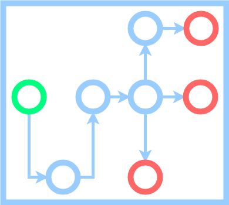

videoflow's documentation
=========================

.. meta::
   :description lang=en: distributed video and stream processing framework, object detection, object tracking, Kubernetes, NATS JetStream.

**Videoflow** is a Python framework for building **distributed** video and stream
processing pipelines. You describe your pipeline once as a directed acyclic graph
of producers, processors and consumers, and Videoflow runs it as a set of
independent workers that communicate over a
`NATS JetStream <https://docs.nats.io/nats-concepts/jetstream>`_ message broker.

The same graph runs two ways with no code changes:

Locally
    As one OS subprocess per node — for fast development and testing.

On Kubernetes
    As one container per node — with per-node scaling, GPU scheduling, health
    probes and autoscaling for production.

Developer friendly
    Even complex pipelines are defined in a small ``build_flow()`` factory of a few
    lines of code.

Reliable
    At-least-once delivery with ack-after-process, per-message de-duplication,
    retries and a dead-letter queue, so a crash or a bad message never silently
    loses or double-emits data.

Easy to extend
    Writing your own producers, processors and consumers is straightforward — sync
    or async, with an optional runtime context.

Language-agnostic
    Components can be written in any language, shipped as container images, and
    dropped into a Python-authored graph by reference — the basis for a component
    marketplace.

Free and open source
    Videoflow uses the MIT License.

.. toctree::
    :maxdepth: 2
    :hidden:
    :caption: First steps

    first-steps/installing-videoflow
    first-steps/getting-started-with-videoflow
    first-steps/how-to-contribute

.. toctree::
    :maxdepth: 2
    :hidden:
    :caption: Core concepts

    user-documentation/nodes-and-flows
    user-documentation/writing-your-own-components
    user-documentation/batch-versus-realtime-mode
    user-documentation/task-allocation
    user-documentation/time-synchronized-joins
    user-documentation/common-patterns

.. toctree::
    :maxdepth: 2
    :hidden:
    :caption: Distributed execution

    distributed/distributed-execution
    distributed/deploying-to-kubernetes
    distributed/language-agnostic-components
    user-documentation/debugging-flow-applications

.. toctree::
    :maxdepth: 2
    :hidden:
    :caption: Under the hood

    user-documentation/advanced-flowing

.. toctree::
    :maxdepth: 2
    :hidden:
    :caption: Computer vision recipes

    computer-vision-recipes/object-tracking-sample-application

.. toctree::
    :maxdepth: 2
    :hidden:
    :caption: API documentation

    apidocs/modules
