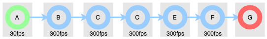
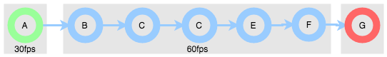

Common Flow Development Patterns
================================

Reducing the number of tasks to be used
---------------------------------------

Assume that we want to run the following flow in a machine that has
4 CPU cores::

    from videoflow.producers import IntProducer
    from videoflow.processors import IdentityProcessor
    from videoflow.consumers.import CommandlineConsumer

    A = IntProducer(0, 40, fps = 30)
    B = IdentityProcessor(fps = 300)(A)
    C = IdentityProcessor(fps = 300)(B)
    D = IdentityProcessor(fps = 300)(C)
    E = IdentityProcessor(fps = 300)(D)
    F = IdentityProcessor(fps = 300)(E)
    G = CommandlineConsumer()(F)

The execution engine will take this graph of 7 nodes, and will create 
7 corresponding tasks, each one running on its independent process.

Usually, the consumers and producers are I/O bound tasks, while the 
processors are CPU bound tasks.  If you have more CPU bound tasks than CPU physical
cores in your system, this can introduced some unwanted or unnecessary 
synchronization overhead.  One way to solve this problem is to group
multiple nodes under the same task.  In order to do that, we can
use the ``TaskModuleNode``. 

The ``TaskModuleNode`` wraps a subgraph of processor nodes, and has the effect 
that the execution engine allocates only one task to execute this subgraph.
Using the ``TaskModuleNode`` the previous example would look like::

    from videoflow.producers import IntProducer
    from videoflow.processors import IdentityProcessor
    from videoflow.consumers.import CommandlineConsumer
    from videoflow.core.node import TaskModuleNode

    A = IntProducer(0, 40, fps = 30)
    B = IdentityProcessor(fps = 300)(A)
    C = IdentityProcessor(fps = 300)(B)
    D = IdentityProcessor(fps = 300)(C)
    E = IdentityProcessor(fps = 300)(D)
    F = IdentityProcessor(fps = 300)(E)
    task_module = TaskModuleNode(entry_node = B, exit_node = F)
    G = CommandlineConsumer()(task_module)

.. note::
    There are certain restrictions in the usage of the ``TaskModuleNode``:
        - All nodes on its subgraph must be **processor nodes**.
        - No node on its subgraph can have ``device_type`` to be ``GPU``
        - There cannot be a ``TaskModuleNode`` nested inside a ``TaskModuleNode``.

Notice that now nodes ``A``, ``B``, ``C``, ``D``, ``E`` and ``F`` are not executed in parallel,
but sequentially, and that effectively reduces the **fps** of the flow
in that section of the graph. 

.. warning::
    You need to be careful when using ``TaskModuleNode``. You can effectively
    introduce bottlenecks in the flow if you are not careful. 
    
    The picture below contains an example of such a case:

    .. image:: ../assets/user-documentation/common-patterns/linear_graph_bottleneck.png

Grouping subgraphs in modules
-----------------------------